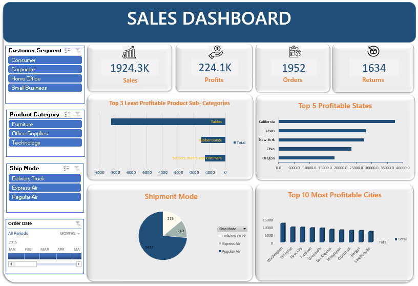

# Excel Sales Dashboard

## Project Overview

Interactive Sales Dashboard built in Microsoft Excel using Power Query, Power Pivot, Data Modeling, Pivot Tables, Pivot Charts, Slicers, Timeline, and KPI Cards.

## Dashboard Preview

## Tools Used

- Microsoft Excel
- Power Query
- Power Pivot
- Data Modeling
- Pivot Tables
- Pivot Charts
- Slicers
- Timeline

## KPIs

- Total Sales
- Total Profit
- Total Orders
- Returned Orders

## Business Insights

- Most Used Shipment Mode
- Top 5 Profitable States
- Top 3 Least Profitable Product Sub-Categories
- Top 10 Most Profitable Cities

## Key Learnings

- Data Cleaning using Power Query
- Creating Relationships using Power Pivot
- Building Data Models
- Creating Interactive Pivot Reports
- Dashboard Design and Formatting
- Using Slicers and Timeline Filters
